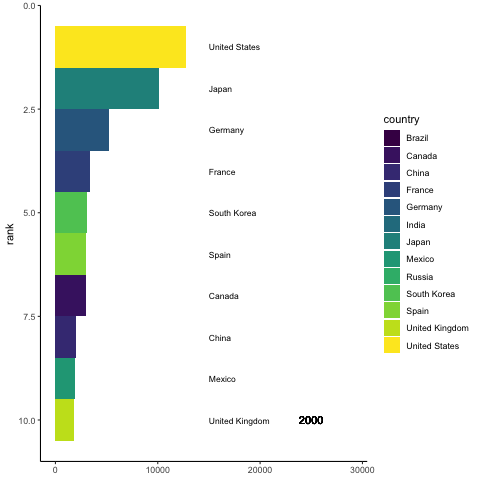

For this project I chose to create time series barplots showing the top 10 countries in terms of (1) CO2 production by transport, and (2) number of road vehicles. The dataset for (1) was obtained from https://ourworldindata.org/transport (see "co2-emissions-transport.csv") and the dataset for (2) was from https://www.bts.gov/content/world-motor-vehicle-production-selected-countries (see "table_01_23_072021.xlsx" for raw data. I put what I needed into the csv file "vehicles3.csv")

Calling in packages and loading in CO2 dataset. Then I ranked all the countries by most CO2 produced per year, and then arranged the dataset to only include top ten ranking countries for each year.

```{r, message=FALSE}
library(tidyverse)
library(gganimate)
co2 = read_csv("co2-emissions-transport.csv") %>%
  drop_na(Transport) %>%
  group_by(Year) %>%
  arrange(Year, -Transport) %>%
  mutate(rank = 1:n()) %>%
  filter(rank <= 10)
```

First, I will make a plot showing the top 10 countries in terms of CO2 produced by transport, for each year.

```{r}
plots_per_year = ggplot(co2, aes(xmin = -10, xmax = Transport,
                                 ymin = rank - 0.5, ymax = rank + 0.5,
                                 y= rank,
                                 fill = Entity))+
  facet_wrap(~ Year) +
  geom_rect()+
  geom_text(x = 0.5e+09, aes(label=Entity), hjust = 0, size = 3)+
  geom_text(x = 1.5e+09, aes(y = 10, label = as.character(Year)))+
  scale_y_reverse()+
  scale_fill_viridis_d()+
  theme_classic()
plots_per_year
```

You can use the following code to make the animation

```{r, eval=FALSE}
plots_per_year + facet_null() +
  transition_time(Year)
anim_save("CO2 from transportation by country.gif", animation = last_animation())

```


Now, doing all the same steps as above for vehicles produced per year, by top ten countries. 
```{r, message=FALSE}
vehicles = read_csv("vehicles3.csv") %>%
  group_by(years) %>%
  arrange(years, -no_cars) %>%
  mutate(rank = 1:n()) %>%
  filter(rank <= 10)
vehicles_per_year = ggplot(vehicles, aes(xmin = -10, xmax = no_cars,
                                  ymin = rank - 0.5, ymax = rank + 0.5,
                                  y= rank,
                                  fill = country))+
  facet_wrap(~ years) +
  geom_rect()+
  geom_text(x = 15000, aes(label=country), hjust = 0, size = 3)+
  geom_text(x = 25000, aes(y = 10, label = as.character(years)))+
  scale_y_reverse()+
  scale_fill_viridis_d()+
  theme_classic()
vehicles_per_year
```

```{r, eval = FALSE}
vehicles_per_year + facet_null() +
  transition_time(years)
anim_save("vehicles per year.gif", animation = last_animation())
```



So it was interesting to see how the US still has most CO2 production by transport even though China takes over and produces more vehicles in recent years. The website said that CO2 from transport includes rail and domestic air as well, the latter I think could be a huge contributor. It was also interesting to see how the ranking changes over time for certain countries. India is not even in the rankings for vehicles produced in the beggining but jumps to 4th place by 2018. While the top 5 did not change much for CO2 produced, the top 10 rankings changed often.
